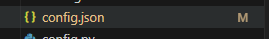
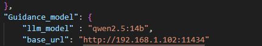
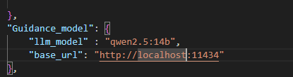
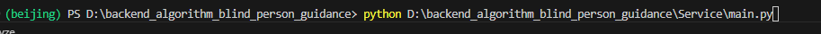
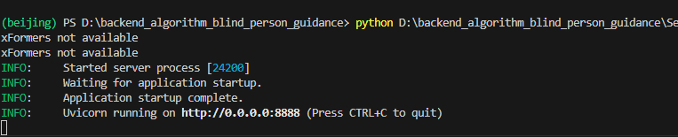

Blind person assistance

Steps to Run The Code 

Step 1:
git clone https://github.com/MuhammadAhmedAbbasi/Backend_Blind_Assistance.git

Step 2:

Download The requirements by typing below:
pip install -r requirements.txt

Additional Point: Before downloading the requirement, it's better to check the Graphic card and download the torch-cuda activated. For this, download cuda and then see the supported torch from website and download it, so code will run on GPU not CPU. The cuda (Nvidia RTX 4070) version for the PC on which code is written is 12.6 and below is the line of code to run

pip3 install torch torchvision torchaudio --index-url https://download.pytorch.org/whl/cu126

Remember to download cuda before installing Torch

Optional :  It's better to create the envornment for clean working of code: 

Command for creating environment: 

python -m venv beijing_project

After this, next command is:

beijing_project/Scripts/activate

After the environment is activated then write below command to install all libraries inside the environment

pip install -r requirements.txt

Step 3:

Now to download Depth Anything, follow the below GITHUB 

https://github.com/DepthAnything/Depth-Anything-V2?tab=readme-ov-file

First clone it :

git clone https://github.com/DepthAnything/Depth-Anything-V2.git

and then put in the "Models" folder, create another folder on Models folder with name of "Depth-Anything-V2-Small" and download the model from below link 

https://huggingface.co/depth-anything/Depth-Anything-V2-Small/resolve/main/depth_anything_v2_vits.pth?download=true

For Guidance Model:

Download Ollama 
Start the Ollama service
Download qwen2.5:14b by write following command in CMD 
ollama pull qwen2.5:14b

Step 4:

Now There is file name "config.json

Open this file, and go the "Guidance_Model" and "base_url" and change the IP from 192.168.... to localhost.

From This :

To:

Note: The config.json file basically contain all the important parameters of project, if user want to change it, it can do accordingly without going to the code.

Step 5:
Now we have to run the main.py

1. Go to Service folder and right click on main.py and copy path (absolute path)

2. Go to the terminal: write  python + (Your absolute path )

After the service starts: It will appear like below format:

